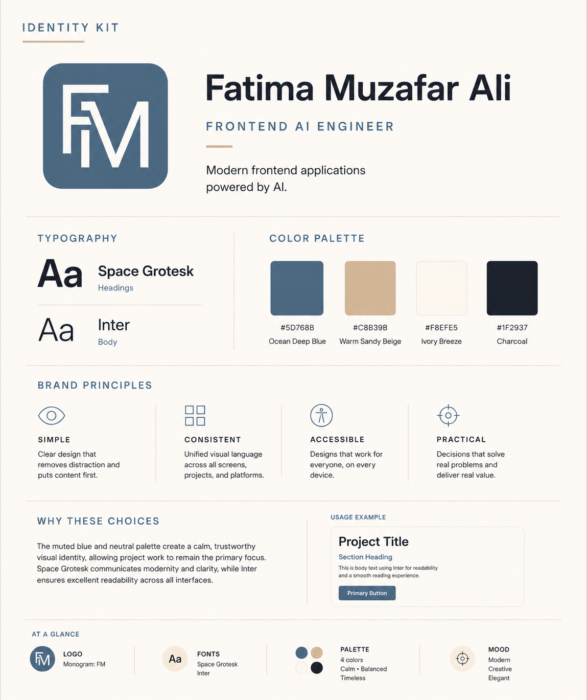
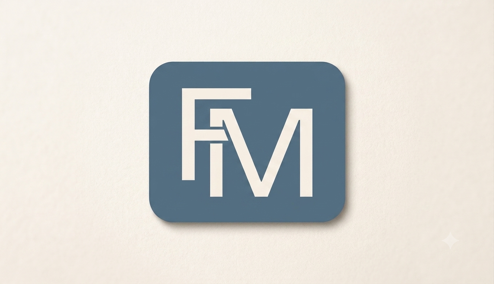

# Identity Kit

**Program:** FlyRank Frontend AI Engineering Internship  
**Week:** 3  
**Assignment:** 1 – Decide Once: Build Your Identity Kit

## Objective

This assignment establishes a consistent visual identity that can be reused across my portfolio, case studies, GitHub repositories, and future projects.

Instead of making design decisions repeatedly, I defined a simple identity system consisting of typography, color palette, logo, and design principles. These choices create a cohesive and professional personal brand that keeps the focus on my work while maintaining consistency across all future deliverables.

---

## Brand Overview

**Name:** Fatima Muzafar Ali

**Role:** Frontend AI Engineer

**Brand Statement:**

> I solve real-world problems by building modern frontend applications with AI, creating accessible and user-focused digital experiences.

---

## Identity Kit Preview

---

## Logo

The **FM** monogram represents my personal brand and serves as both my primary logo and favicon. Designed with simplicity and longevity in mind, it reflects a modern, professional identity while avoiding decorative elements and AI-related clichés.

---

## Typography

| Purpose | Font |
|----------|------|
| Headings | Space Grotesk |
| Body Text | Inter |

This combination provides a modern visual hierarchy while maintaining excellent readability across different screen sizes.

---

## Color Palette

| Purpose | Color | Hex |
|----------|--------|------|
| Primary | Ocean Deep Blue | `#5D768B` |
| Accent | Warm Sandy Beige | `#C8B39B` |
| Background | Ivory Breeze | `#F8EFE5` |
| Text | Charcoal | `#1F2937` |

These colors create a calm, professional aesthetic that allows the portfolio projects to remain the primary focus.

---

## Brand Personality

- Modern
- Creative
- Elegant

---

## Design Principles

This identity is guided by four core principles:

- **Simple** — Remove unnecessary visual noise and prioritize clarity.
- **Consistent** — Maintain a unified visual language across projects and platforms.
- **Accessible** — Design interfaces that are readable, inclusive, and user-friendly.
- **Practical** — Focus on solving real problems through thoughtful frontend engineering.

---

## Style Note

**Typography:** Space Grotesk for headings and logo, Inter for body text.

**Palette:** `#5D768B`, `#C8B39B`, `#F8EFE5`, and `#1F2937`.

**Mood:** Modern, creative, and elegant with a calm visual style that emphasizes usability and allows the work to speak for itself.

---

## Deliverables

- ✅ Identity Kit
- ✅ Typography System
- ✅ Color Palette
- ✅ FM Monogram Logo
- ✅ Brand Personality
- ✅ Design Principles
- ✅ Style Note

---

## Reflection

This assignment helped me define a reusable visual identity instead of making design decisions for each new project. Establishing these standards early will help maintain consistency across my portfolio and future frontend AI projects while reinforcing a professional and recognizable personal brand.