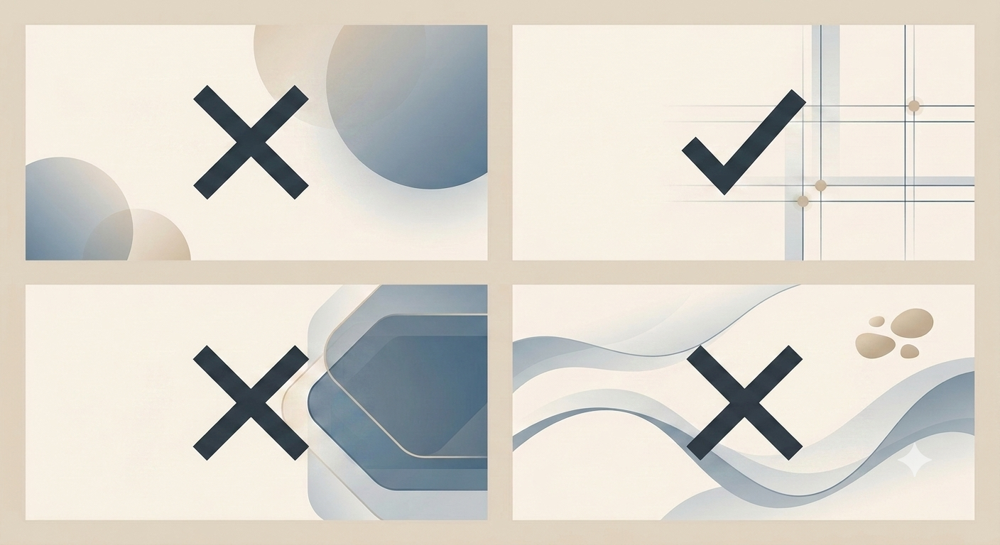

# Image Direction & Curation

**Program:** FlyRank Frontend AI Engineering Internship  
**Week:** 3  
**Assignment:** 2 – Image Direction & Curation

## Objective

This assignment focused on making intentional visual decisions rather than simply generating images with AI. Instead of using AI as the decision-maker, I used it to explore multiple options, evaluated each concept against my Identity Kit, and selected the visual that best supports my portfolio while rejecting those that competed with my work.

---

## Final Image Set

| Portfolio Section | Image | Type |
|-------------------|-------|------|
| Hero | Concept 2 – Linear Architectural Grid | AI-generated |
| About | Professional portrait (AI-enhanced from my real photo) | Real photo |
| Project 1 | Sign-Up Form screenshot | Real screenshot |
| Project 2 | WriteAI screenshot | Real screenshot |
| Project 3 | Travel Gallery screenshot | Real screenshot |
| Logo | FM Monogram | Original design |

---

## Hero Background Review

After generating four hero background concepts, I compared them against my Identity Kit and portfolio goals before making a final selection.

---

## Final Decision

### Selected: Concept 2 – Linear Architectural Grid

I generated four hero background concepts and used AI to critique them. While the review recommended **Concept 1** as the strongest overall option, I intentionally selected **Concept 2** after comparing each concept against my Identity Kit, proof statement, and the audience my portfolio is designed for.

My portfolio targets **technical founders and engineering teams at early-stage AI startups**. I want the visual identity to communicate precision, clarity, and thoughtful engineering rather than decoration. Concept 2 achieves this through its subtle architectural grid, restrained composition, and generous whitespace. It supports my content without competing for attention, allowing my projects and proof statement to remain the primary focus.

Concept 1 is visually elegant, but its soft gradient orbs felt more decorative than purposeful for the identity I want to establish. Concept 2 better reflects the values defined in my Identity Kit—**simple, consistent, accessible, and practical**—while reinforcing the structured approach I take to frontend engineering.

The AI review helped me evaluate the strengths and weaknesses of each option, but it did not make the decision for me. I chose Concept 2 because it best represents the professional identity I want my portfolio to communicate, even though it was not the AI's top recommendation.

---

## Where I Chose Real Images Over AI

I intentionally used real visuals whenever authenticity was more important than generation.

- **Profile Photo:** I used a real photo of myself as the foundation and enhanced it with AI to create a more professional portrait while keeping the subject authentic.
- **Project Screenshots:** All portfolio projects are represented using real screenshots of the applications I built.
- **Logo:** I used my original FM monogram created during the Identity Kit assignment instead of generating a new logo with AI.

AI was used only for supporting visuals, not as a replacement for evidence of my work.

---

## Rejected Concepts

- **Concept 1 – Soft Gradient Orbs:** A balanced and elegant design, but I preferred the structured visual language of Concept 2 because it better reflects my engineering-focused identity.
- **Concept 3 – Hexagon Panel:** Rejected because the large geometric shape competed with the portfolio content instead of supporting it.
- **Concept 4 – Flowing Waves:** Rejected because the strong central wave became the visual focus and felt more trend-driven than timeless.

---

## Reflection

This assignment reinforced that effective visual design is about thoughtful selection rather than generating as many images as possible. Using AI to explore multiple directions helped me evaluate different options, but the final decision was guided by my Identity Kit, proof statement, and the type of professional portfolio I want to build. The process emphasized consistency, authenticity, and ensuring that the visuals support my work instead of competing with it.