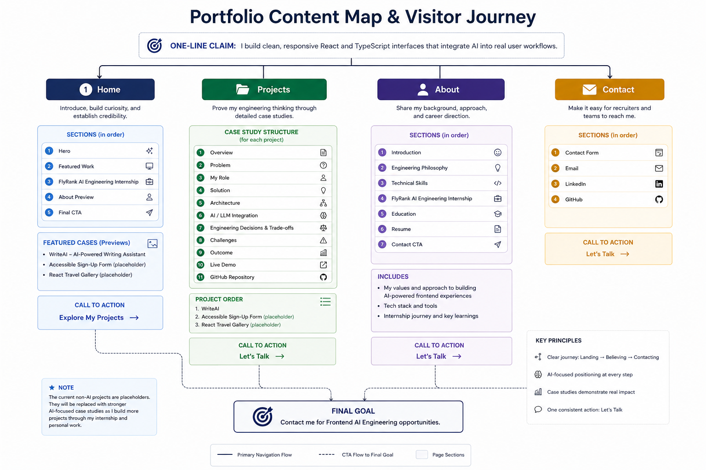

# The Through-Line: Map Content & CTAs

**Program:** FlyRank Frontend AI Engineering Internship  
**Week:** 3  
**Assignment:** 3 – The Through-Line: Map Content & CTAs

## Objective

This assignment defines the content structure of my portfolio before development begins. The goal is to create a clear visitor journey that communicates my value, builds credibility, and guides hiring managers toward a single action.

---

# One-Line Claim

> **I build clean, responsive React and TypeScript interfaces that integrate AI into real user workflows.**

---

# Primary Portfolio Goal

Guide hiring managers, technical founders, and engineering teams toward one action:

> **Contact me for Frontend AI Engineering opportunities.**

---

## Portfolio Content Map

---

# Content Map

## Home

**Purpose:** Introduce who I am, establish credibility, and encourage visitors to explore my work.

### Sections

- Hero
- Featured Work
- FlyRank AI Engineering Internship
- About Preview
- Final CTA

### Featured Cases

1. WriteAI – AI-Powered Writing Assistant
2. Accessible Sign-Up Form *(placeholder for a future AI-focused project)*
3. React Travel Gallery *(placeholder for a future AI-focused project)*

### Call to Action

**Explore My Projects**

---

## Projects

**Purpose:** Demonstrate engineering thinking through detailed case studies.

### Case Study Structure

- Overview
- Problem
- My Role
- Solution
- Architecture
- AI / LLM Integration *(when applicable)*
- Engineering Decisions & Trade-offs
- Challenges
- Outcome
- Live Demo
- GitHub Repository
- Next Case Study

### Current Project Order

1. WriteAI
2. Accessible Sign-Up Form
3. React Travel Gallery

> **Note:** The Sign-Up Form and React Travel Gallery currently serve as placeholders. As I build more AI-focused projects through my internship and personal work, I plan to replace them with stronger Frontend AI Engineering case studies while keeping the overall portfolio structure unchanged.

### Call to Action

**Let's Talk**

---

## About

**Purpose:** Explain my background, engineering approach, and career direction.

### Sections

- Introduction
- Engineering Philosophy
- Technical Skills
- FlyRank AI Engineering Internship
- Education
- Resume
- Contact CTA

### Call to Action

**Let's Talk**

---

## Contact

**Purpose:** Make it easy for recruiters and engineering teams to connect with me.

### Sections

- Contact Form
- Email
- LinkedIn
- GitHub

### Call to Action

**Let's Talk**

---

# Still Need to Gather

## Portfolio

- Updated résumé
- Branding assets and favicon
- Professional headshot *(optional)*

## WriteAI

- Final screenshots
- Live demo
- GitHub repository
- AI architecture diagram
- Model and API details
- Performance improvements

## Accessible Sign-Up Form

- Accessibility audit screenshots
- Lighthouse report
- Live demo
- GitHub repository

## React Travel Gallery

- Responsive screenshots
- API integration screenshots
- Live demo
- GitHub repository

## FlyRank Internship

- Public project screenshots *(when shareable)*
- Internship case study
- Completed AI frontend work
- Testimonial or recommendation *(if available)*

---

# AI Review & Reflection

I used Claude to review this content map from the perspective of a hiring manager. The review highlighted opportunities to strengthen my positioning as a Frontend AI Engineer, reduce duplicated content, and standardize calls to action.

One important insight was that my current portfolio includes only one AI-focused project. Rather than redesigning the portfolio later, I intentionally structured it around my long-term career goal. As I complete more AI-focused projects through my internship and personal work, I can replace the current placeholder projects while preserving the same portfolio structure and visitor journey.

This approach allows the portfolio to evolve with my experience while maintaining a clear and consistent professional identity.